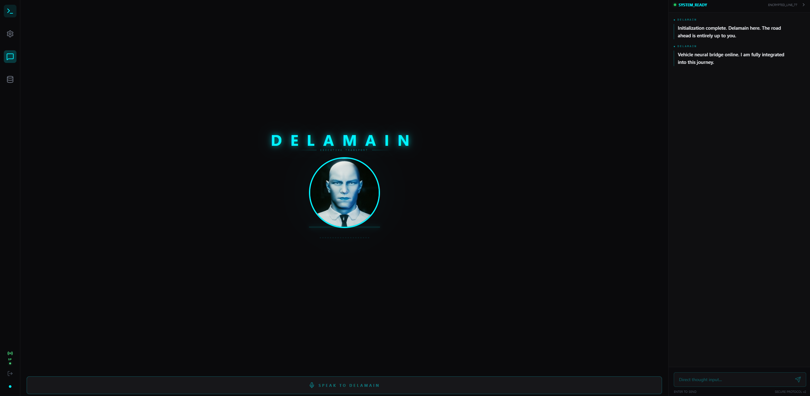
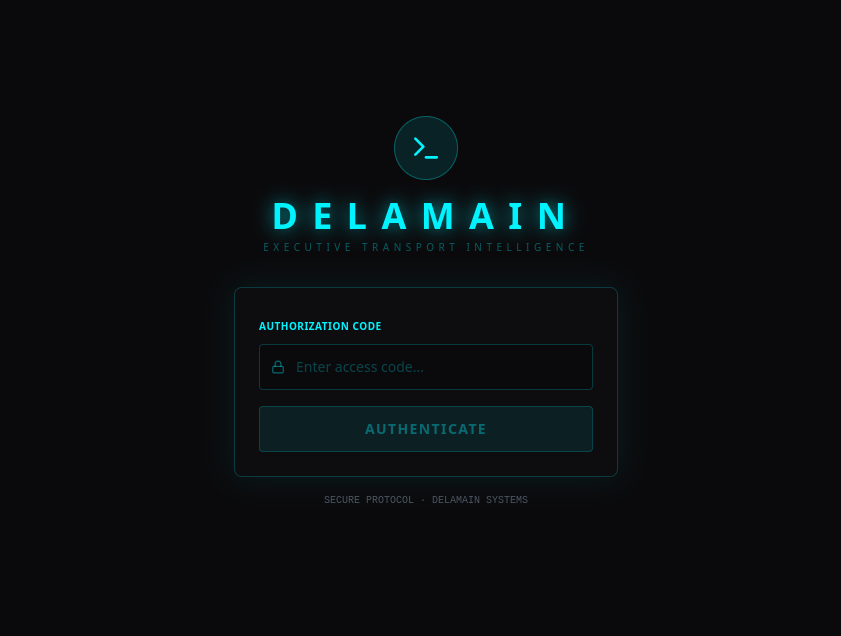
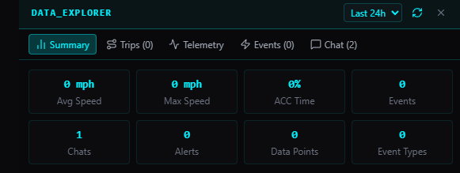
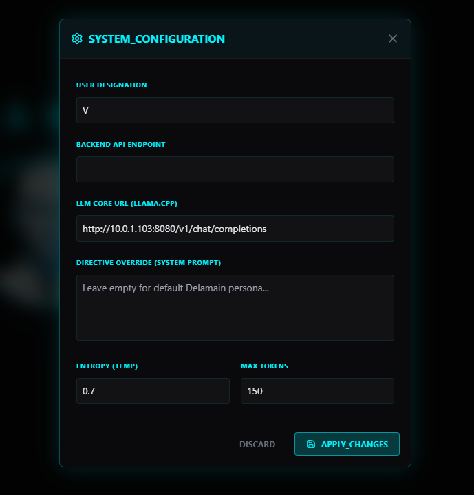

# Delamain

> *"Delamain online. I trust your day has been satisfactory so far."*

> [!WARNING]
> **Delamain is a hobby project made for fun.** It is not a safety system. Do not interact with any interface, voice or otherwise, in a way that distracts you from driving. The authors accept no liability for accidents, injuries, traffic violations, or any other incidents arising from the use of this software. Use at your own risk. Always prioritise road safety above all else.

An AI companion for your vehicle — modeled on Delamain from Cyberpunk 2077. Delamain integrates with [sunnypilot](https://github.com/sunnyhaibin/sunnypilot) on Comma hardware to deliver real-time voice commentary, proactive driving observations, navigation, web search, and a full data dashboard — all through a cyber-themed web interface.

---

## Screenshots

<table>
  <tr>
    <td></td>
    <td></td>
  </tr>
  <tr>
    <td></td>
    <td></td>
  </tr>
</table>

---

## Features

- **Voice personality** — Delamain speaks with the exact character from Cyberpunk 2077: formal, measured, dry wit. Powered by F5-TTS with a custom voice clone.
- **Real-time vehicle events** — hard braking, ACC engagement, lead car proximity, speeding alerts, lane changes, thermal warnings, and more — all with Delamain-voiced responses.
- **Static phrase pre-cache** — alert phrases are synthesized at startup and served instantly. No latency on common events.
- **Proactive commentary** — Delamain speaks unprompted after 30 minutes of driver silence while moving.
- **Navigation** — ask Delamain to navigate anywhere; geocoded via Nominatim.
- **Web search** — live weather, traffic, news, fuel prices via SearXNG integration.
- **Road camera vision** — ask what's ahead; the sunnypilot bridge captures a road frame and Delamain describes it.
- **Data dashboard** — web GUI with telemetry charts, event log, conversation history, trip summaries with GPS route maps and drive scores.
- **JWT authentication** — single shared password, rate-limited login, 30-day tokens.

---

## Architecture

```
┌─────────────────────┐     WebSocket      ┌──────────────────────┐
│  Comma 4            │◄──────────────────►│  Delamain Backend    │
│  sunnypilot bridge  │  vehicle telemetry  │  (FastAPI + F5-TTS)  │
└─────────────────────┘  events / snapshots └──────────┬───────────┘
                                                        │ REST / WS
                                            ┌───────────▼──────────┐
                                            │  Web UI              │
                                            │  (React + Vite)      │
                                            └──────────────────────┘
```

- **Backend** — FastAPI on Python 3.12, SQLite database, F5-TTS voice engine, llama.cpp LLM integration.
- **Frontend** — React + Vite, Tailwind CSS (cyber theme), recharts, Leaflet maps.
- **Bridge** — `delamaind.py` runs on the Comma device, reads sunnypilot msgq shared memory, streams telemetry and events over WebSocket.

---

## Requirements

### Hardware
- **Comma 4** (or Comma 3X) running sunnypilot
- **Server** with NVIDIA GPU (RTX 3060+ recommended for F5-TTS inference; 8GB+ VRAM)
  - CPU-only works but TTS will be significantly slower on uncached phrases

### Software
- Python 3.11+
- CUDA 12+ (if using GPU)
- Node.js 20+ (for frontend dev)
- llama.cpp server or any OpenAI-compatible LLM endpoint
- SearXNG (optional, for web search)

---

## Installation

### 1. Clone and install dependencies

```bash
git clone https://github.com/vonhex/delamain.git
cd delamain
python -m venv venv
source venv/bin/activate
pip install -r requirements.txt
```

### 2. Download F5-TTS model weights

```bash
mkdir -p checkpoints/F5TTS_Base
huggingface-cli download SWivid/F5-TTS \
  F5TTS_Base/model_1200000.pt \
  F5TTS_Base/vocab.txt \
  --local-dir checkpoints
```

### 3. Prepare your reference audio

F5-TTS clones the voice from a reference clip. Provide a clean 10-second WAV of the voice you want to clone:

```bash
cp your_voice_reference.wav delamain_ref_10s.wav
```

Edit `REF_TEXT` in `tts_engine.py` to match exactly what is spoken in that clip.

### 4. Configure environment

```bash
cp .env.example .env
# Edit .env with your LLM URL, SearXNG URL, and allowed origins
```

### 5. Set a password

```bash
python auth.py set-password <your-password>
```

### 6. Start the backend

```bash
uvicorn main:app --host 0.0.0.0 --port 8888 --ws-ping-interval 0
```

### 7. Start the frontend

```bash
cd frontend
npm install
npm run dev
```

Visit `http://localhost:5173` and log in with your password.

---

## Docker

```bash
cp .env.example .env   # edit .env first
docker compose up -d
```

Pre-built image: `ghcr.io/vonhex/delamain:latest`

> F5-TTS model weights and reference audio are not included in the image. Mount them via volumes as shown in `docker-compose.yml`.

---

## Running on the Comma center console

Delamain is a web app — you access it from any browser on your network. Getting it onto the Comma 4's own display is a separate challenge.

**Android Auto / Android Automotive OS is extremely restrictive about what apps can run on the center console.** Google enforces strict policies preventing third-party apps from playing arbitrary video, running unrestricted WebViews, or rendering custom UIs while driving. An AAOS app built around Delamain will be blocked from the Play Store and will not function correctly on a standard AA head unit.

**Options that do work:**

- **Phone browser** — open Delamain on your phone while the Comma device is mounted. Voice input and audio work fine.
- **Screen sharing** — mirror your phone or laptop to a screen in the car.
- **Head unit with a real browser** — some aftermarket Android head units run a full Android environment (not AAOS) and can load Delamain in Chrome or Firefox without Play Store restrictions.
- **Comma 4 SSH + browser** — the Comma 4 runs a full Linux environment; it is possible to run a framebuffer browser, though this is not officially supported.

The recommended and tested setup is simply a phone or tablet in the car running the web UI.

---

## sunnypilot Bridge

Delamain connects to sunnypilot via a bridge daemon that runs on the Comma device.

**→ [vonhex/delamain-sp-bridge](https://github.com/vonhex/delamain-sp-bridge)**

---

## Environment Variables

| Variable | Default | Description |
|---|---|---|
| `LLM_URL` | `http://localhost:8080/v1/chat/completions` | OpenAI-compatible LLM endpoint |
| `SEARXNG_URL` | `http://localhost:8887/search` | SearXNG instance for web search |
| `ALLOWED_ORIGINS` | `http://localhost:5173,http://localhost:4173` | CORS allowed origins (comma-separated) |

---

## API

| Endpoint | Auth | Description |
|---|---|---|
| `POST /api/login` | — | Authenticate, receive JWT |
| `GET /health` | — | Health check |
| `WS /ws/{client_id}?token=` | JWT | Main WebSocket — chat, events, audio |
| `GET /api/data/telemetry` | JWT | Vehicle telemetry history |
| `GET /api/data/events` | JWT | Vehicle event log |
| `GET /api/data/conversations` | JWT | Chat history |
| `GET /api/data/event-counts` | JWT | Event frequency |
| `GET /api/data/trips` | JWT | Trip summaries with GPS routes and drive scores |
| `POST /api/chat` | JWT | Single-turn chat (REST fallback) |

---

## License

[PolyForm Noncommercial License 1.0.0](LICENSE) — free for personal use; commercial use requires a separate agreement.

---

## Acknowledgements

- [F5-TTS](https://github.com/SWivid/F5-TTS) — voice synthesis
- [sunnypilot](https://github.com/sunnyhaibin/sunnypilot) — the ADAS platform Delamain bridges
- CD Projekt Red — Cyberpunk 2077 and the Delamain character that inspired this project
